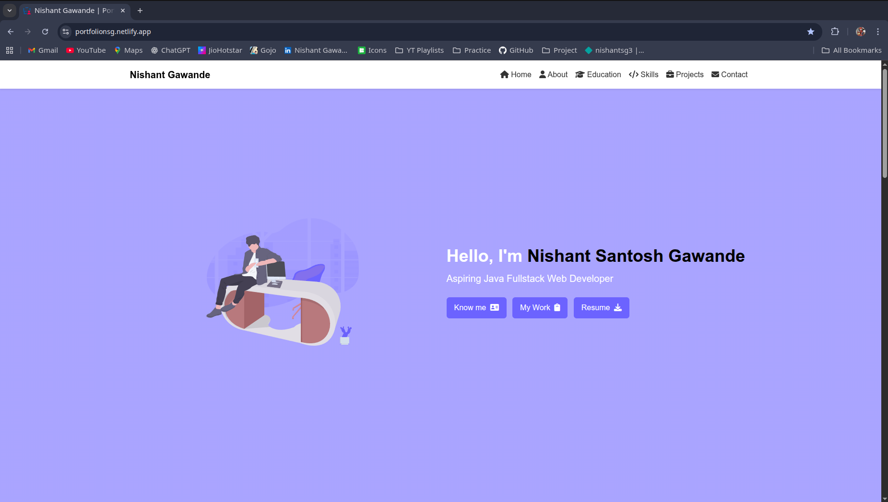
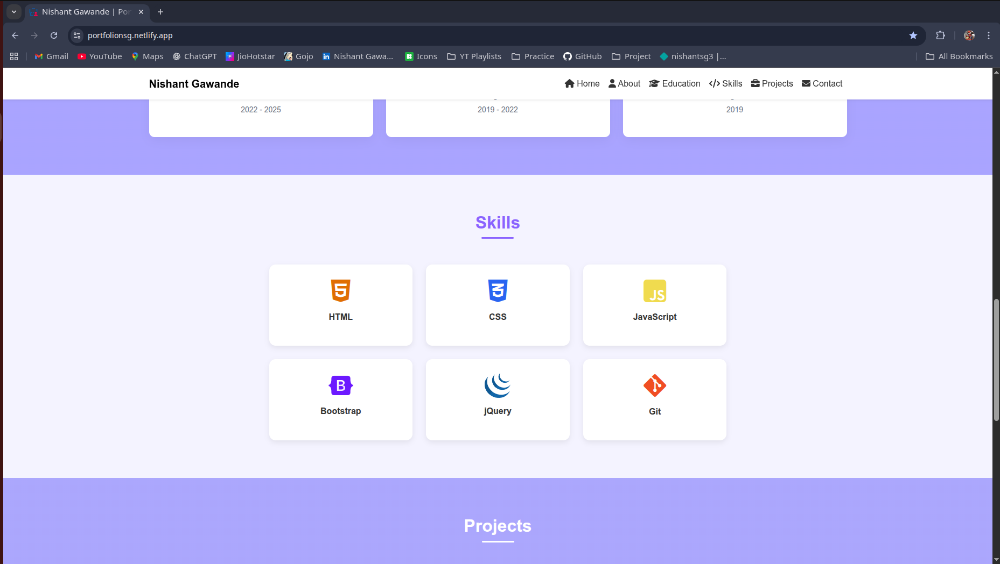
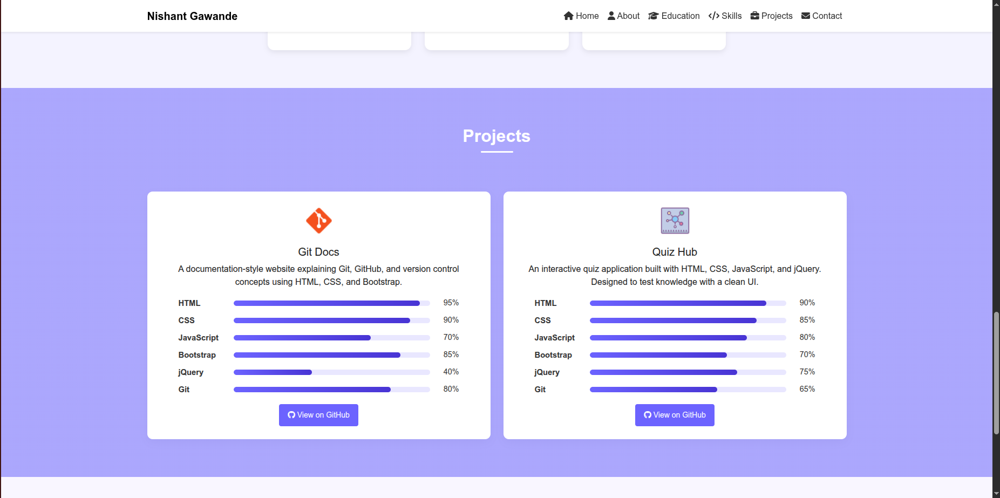
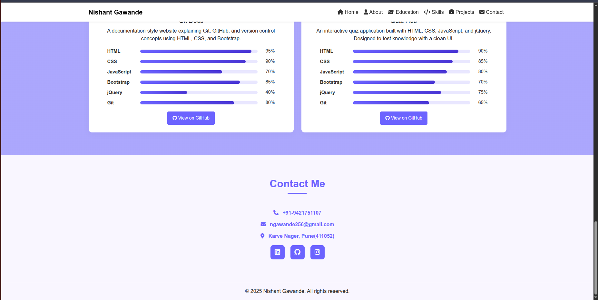

🌐 Personal Portfolio Website

A modern, responsive portfolio website to showcase my skills, projects, and achievements as an aspiring Full-Stack Java Developer.
Built with HTML, CSS, JavaScript, and Bootstrap, it serves as both my digital resume and a professional showcase.

🌍 Live Demo → Portfolio Website

✨ Features

✔️ About Me section introducing myself professionally
✔️ Skills Section with progress bars for technical expertise
✔️ Projects Showcase with clean layout and visuals
✔️ Contact Me section with icons & working links
✔️ Responsive Design – adapts to all screen sizes
✔️ Fancy profile picture animation for engaging UI

🛠️ Tech Stack

HTML5 → Structure & content

CSS3 → Styling, animations, and responsiveness

JavaScript (ES6) → Interactivity

Bootstrap 5 → Grid system & components

Git & GitHub → Version control

Netlify → Deployment & hosting

📂 Project Structure

Portfolio-Website/
│── assets/img/ # Images & logos
│── assets/preview #Images for preview
│── index.html # Main portfolio page
│── style.css # Custom styling
│── script.js # Animations & interactions

📸 Screenshots

### Homepage 

### Skills Section

### Projects Showcase

### Contact Section

🚀 Future Improvements

🌙 Add Dark/Light Theme Toggle

📂 Dynamic project cards from JSON/Database

✨ Add animations & transitions for smoother UX

📱 Enhance mobile optimization further

👤 Author

Nishant Gawande

GitHub: @Nishantsg3

Netlify: [(https://portfolionsg-web.netlify.app)]

⭐ If you like this project, don’t forget to star the repo and share it!
