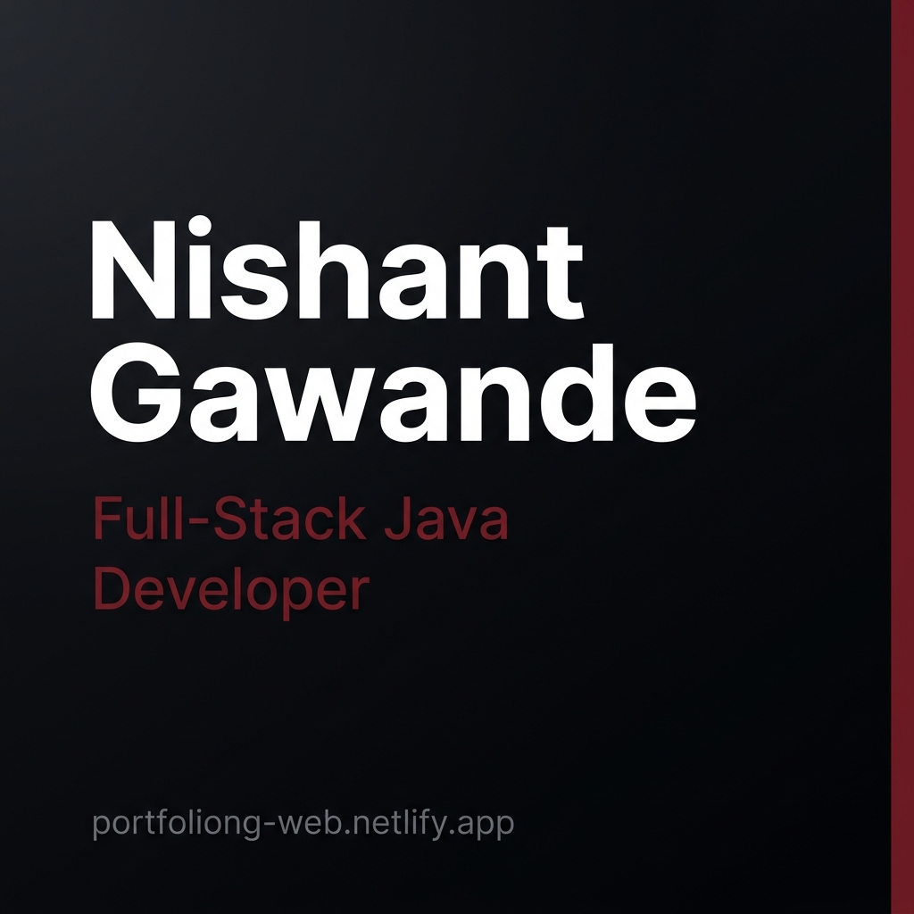

<p align="center">
  
</p>

<h1 align="center">&lt;NG/&gt; — Portfolio</h1>

<p align="center">
  <b>Full-Stack Java Developer</b> · Java · Spring Boot · React · MySQL<br>
  <a href="https://portfoliong-web.netlify.app">🌐 Live Site</a> · <a href="https://linkedin.com/in/nishant-g3">LinkedIn</a> · <a href="https://github.com/Nishantsg3">GitHub</a>
</p>

<p align="center">
  
  
  
  
</p>

---

## ✨ Features

| Category | Details |
|:---------|:--------|
| **Design** | Dark theme, crimson accents, glassmorphism, anime-inspired SVG icons |
| **Animations** | Preloader, scroll reveals, 3D card tilt, typewriter effect, stat counter |
| **Interactive** | Magnetic CTAs, cursor follower, parallax hero, dynamic page titles |
| **Mobile** | Fully responsive (1024/768/480/360px), touch-optimized, finger-swipe scroll indicator |
| **SEO** | Open Graph, Twitter Cards, sitemap, robots.txt, semantic HTML |
| **Performance** | `content-visibility: auto`, lazy loading, `prefers-reduced-motion` support |
| **Contact** | Working form via Formspree, email copy-to-clipboard |
| **Easter Eggs** | 11 hidden interactions — type `?` to reveal the cheat sheet |

---

## 📸 Screenshots

<p align="center">
  
</p>

---

## 📁 Project Structure

```
Portfolio/
├── index.html                    # Single-page app — all sections
├── css/
│   └── style.css                 # 2500+ lines — BEM, custom properties, responsive
├── js/
│   └── script.js                 # 34 features — core, easter eggs, polish
├── img/
│   ├── bg.jpg                    # Profile photo
│   ├── favicon.png               # Browser tab icon
│   └── og-preview.png            # Social media share image
├── assets/
│   └── certificates/             # cert1.jpg – cert5.jpg
├── Nishant_Gawande_9421751107.pdf  # Resume (downloadable)
├── manifest.json                 # PWA-lite manifest
├── robots.txt                    # Search engine rules
├── sitemap.xml                   # Sitemap for crawlers
├── _headers                      # Netlify security & caching headers
├── _redirects                    # Netlify SPA fallback
└── .gitignore
```

---

## 🛠️ Tech Stack

- **HTML5** — Semantic markup, accessibility (ARIA), SEO meta tags
- **CSS3** — Custom properties, BEM, animations, glassmorphism, 4 breakpoints
- **JavaScript (ES6+)** — IntersectionObserver, Web APIs, IIFEs, strict mode
- **Font Awesome 6** — Icon library
- **Google Fonts** — Inter, Space Grotesk, JetBrains Mono, DM Serif Display, Outfit
- **Formspree** — Contact form backend
- **Netlify** — Hosting with custom headers & redirects

---

## 🎮 Easter Eggs

Type `?` (hold it) to reveal the cheat sheet, or try these:

| Trigger | Effect |
|:--------|:-------|
| `↑↑↓↓←→←→BA` | Konami Code flash |
| 3× click `<NG/>` logo | Matrix rain |
| Type `1337` | Hacker flash |
| Hover logo 2s | Logo glitch |
| Type `bankai` | Anime screen shake |
| Type `roll` | Barrel roll |
| 5× click year | Time warp scramble |
| Type `blue` / `gold` / `green` | Color theme swap |
| 3× click "Solid." | 🧱 |
| `F12` console | Dev greeting |

---

## 🚀 Run Locally

```bash
# Clone the repo
git clone https://github.com/Nishantsg3/Portfolio.git
cd Portfolio

# Open in browser (any method works)
open index.html        # macOS
xdg-open index.html    # Linux
start index.html       # Windows

# Or use a local server
npx serve .
```

---

## 🌍 Browser Support

| Browser | Status |
|:--------|:-------|
| Chrome / Edge | ✅ |
| Firefox | ✅ |
| Safari | ✅ |
| Mobile (iOS/Android) | ✅ |

---

## 📬 Contact

**Nishant Gawande**

- 📧 [ngawande256@gmail.com](mailto:ngawande256@gmail.com)
- 💼 [LinkedIn](https://linkedin.com/in/nishant-g3)
- 🐙 [GitHub](https://github.com/Nishantsg3)

---

## 📝 License

Free to use for personal portfolios. Credit appreciated.

⭐ If you like this portfolio, **star the repo!**